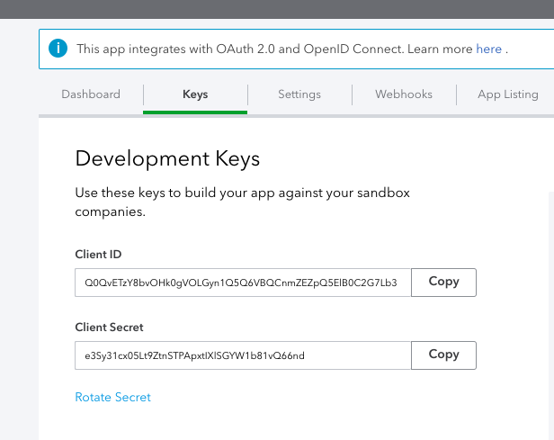
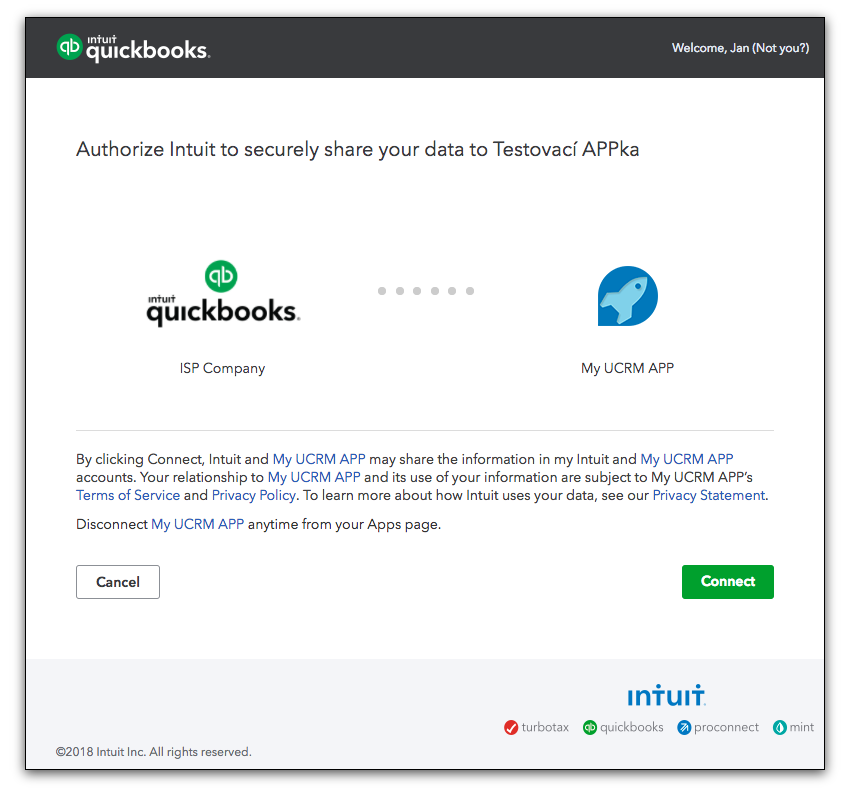

# QuickBooks Online import
This plugin handles import of your [UCRM](https://ucrm.ubnt.com/) customers, payments and invoices to 
[QuickBooks Online](https://quickbooks.intuit.com/online/).

## About UCRM data integration
- The UCRM data are the single source of truth, the plugin only pushes data from UCRM to QuickBooks. 
- On first run, all clients, payments and invoices are pushed to QuickBooks.
- All following runs only pushes the newly created entities (i.e. new clients, new payments and new invoices with higher ID than the last).

## How to configure the plugin
#### 1) QuickBooks - Create App
- Create developer account at [Intuit Developer](https://developer.intuit.com/) site.
- After you go through the registration process, [create new app](https://developer.intuit.com/v2/ui#/app/startcreate).
- Choose __Select APIs__ and check __Accounting__ and __Payments__ options.

#### 2) QuickBooks - App settings
- Go to the __Keys__ tab on your app's dashboard.
- Get the __Client ID__ and __Client Secret__ keys from this page, you will need them to configure the plugin in UCRM.

- Take __Public URL__ from the plugin's detail page in UCRM and fill it in as the __Redirect URI__  on the app's __Keys__ tab.

#### 3) UCRM - plugin configuration
- Go to the UCRM plugin configuration page.
- Fill in __Client ID__ and __Client Secret__ keys, which you got in QuickBooks.
- If you're testing and have testing keys, fill in `Development` into the __Account type__ field. Otherwise, fill in `Production`.
- Finally, fill in your **Income account number**.

 
#### 4) Connect UCRM with your Intuit App
- Wait until the plugin executes, or execute it manually.
- You will see the Authorization URL in the plugin's log.

- Open it in your browser and confirm the connection.

- After confirmation, you will see `Authorization Code obtained.` message in the log.
- Wait until the plugin executes again, or do it manually.
- You will now see the message `Exchange Authorization Code for Access Token succeeded.`.
- Congratulations, UCRM and QuickBooks are now properly connected.

## To be done in future version
(Feel free to push your upgrades in this repo.)
- Configurable date of the first payment or invoice to be imported. 
- Remove entity from QB when the related entity is deleted in UCRM.
